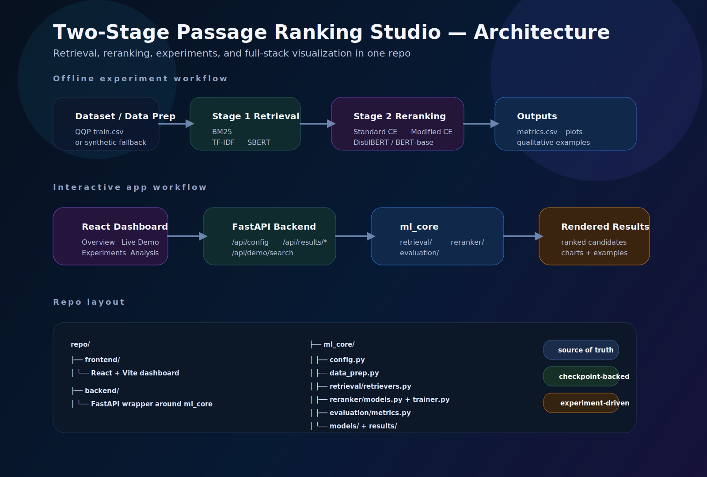

# Two-Stage Passage Ranking Studio

<p align="center">
  
  
  
  
  
</p>

A full-stack research demo for **two-stage passage ranking**: retrieve candidate passages fast, rerank them with cross-encoders, compare retrieval vs reranking side by side, and inspect saved experiments through an interactive dashboard.

---

## What this project does

This project starts with a standard two-stage ranking pipeline:

- **Stage 1 retrieval** uses **BM25**, **TF-IDF + cosine similarity**, or **Sentence-BERT** to fetch the top-k candidate passages.
- **Stage 2 reranking** applies either a **standard cross-encoder** or a **modified cross-encoder** to reorder those candidates with stronger query-document interaction.
- The project also includes **experiment tracking**, **qualitative analysis**, **ablation studies**, and a **React + FastAPI dashboard** for interactive inspection.

The dataset mapping follows **Quora Question Pairs (QQP)** style ranking, where `question1` acts as the query, `question2` acts as the candidate passage, and `is_duplicate` is the relevance label.

---

## Demo


---

## How it works

### Data pipeline
1. Load **real QQP data** from `ml_core/data/train.csv` when available, otherwise fall back to the synthetic QQP-style generator.
2. Split data into **train / validation / test** sets.
3. Build training triplets of **query / positive / negative** examples.
4. Prepare a shared candidate corpus from `question2` values.

### Retrieval pipeline
1. A user query is passed to one of the first-stage retrievers.
2. The retriever returns the **top-k candidate IDs and scores**.
3. Candidates can come from:
   - **BM25**
   - **TF-IDF**
   - **SBERT**

### Reranking pipeline
1. The same query and candidate texts are converted into query-document pairs.
2. A checkpoint-backed reranker scores each pair.
3. The system reorders the candidate list using:
   - **Standard CE** — classification head only
   - **Modified CE** — logits + cosine-similarity signal
4. The UI then shows **before vs after ranking** side by side.

### Experiment outputs
The project saves:
- ranking metrics like **nDCG@k**, **MRR@k**, **MAP@k**, **Precision@k**, **Recall@k**
- retrieval comparison charts
- full pipeline comparison charts
- training loss curves
- ablation plots for loss weight, learning rate, training size, hard negatives, and top-k
- qualitative examples explaining what moved and why

---

## Architecture



### Flow summary

**Offline experiment workflow**
- Data prep → retrieval evaluation → reranker training → ablation studies → saved charts / CSVs / checkpoints

**Interactive app workflow**
- React dashboard → FastAPI backend → `ml_core` retrieval / reranking modules → results returned to the UI

---

## Key features

- Interactive **retrieval vs reranking** comparison
- Support for **BM25**, **TF-IDF**, and **SBERT** retrieval
- Support for **Standard CE** and **Modified CE** rerankers
- Full **experiment dashboard** with saved charts and metrics
- **Qualitative analysis** examples from saved runs
- Clean separation between:
  - `frontend/`
  - `backend/`
  - `ml_core/`

---

## Project structure

```text
.
├── frontend/                     # React + Vite dashboard
├── backend/                      # FastAPI app and API routes
├── ml_core/                      # Original ML project kept as the source of truth
│   ├── config.py                 # Paths, hyperparameters, model names
│   ├── data_prep.py              # Data loading, splits, triplets
│   ├── retrieval/
│   │   └── retrievers.py         # BM25, TF-IDF, SBERT
│   ├── reranker/
│   │   ├── models.py             # Standard and Modified cross-encoders
│   │   └── trainer.py            # Training and reranking logic
│   ├── evaluation/
│   │   └── metrics.py            # nDCG, MRR, MAP, Recall, Precision
│   ├── models/                   # Saved .pt checkpoints
│   ├── results/                  # Saved plots, CSVs, qualitative outputs
│   ├── run_experiments.py        # Sklearn/proxy pipeline runner
│   ├── run_transformers.py       # Transformer-based experiment runner
│   └── README.md
├── docker-compose.yml
└── README.md
```

---

## Tech stack

| Layer | Technology | Why it is used |
|---|---|---|
| **Frontend** | React + Vite + Tailwind | Fast local development, clean dashboard UI |
| **Backend** | FastAPI | Lightweight API wrapper for config, metrics, examples, and live search |
| **Retrieval** | BM25, TF-IDF, Sentence-BERT | Strong baseline coverage for sparse and dense retrieval |
| **Reranking** | DistilBERT / BERT cross-encoders | Stronger query-document interaction than first-stage retrieval alone |
| **Training** | PyTorch + Transformers | Fine-tuning and checkpointed reranker experiments |
| **Evaluation** | Custom ranking metrics | nDCG, MRR, MAP, Precision, Recall |
| **Visualization** | Matplotlib + saved PNG outputs | Experiment charts and ablation visualizations |

---

## Setup

### 1. Clone the repo

```bash
git clone <your-repo-url>
cd <your-repo-folder>
```

### 2. Backend

```bash
cd backend
python3.11 -m venv .venv
source .venv/bin/activate
pip install -r requirements.txt
uvicorn app.main:app --reload --port 8070
```

### 3. Frontend

```bash
cd frontend
npm install
npm run dev
```

### 4. Open the app

```text
Frontend: http://localhost:5173
Backend:  http://localhost:8070
```

> If your Vite proxy points to a different backend port, update `frontend/vite.config.js` accordingly.

---

## Recommended tests

These are good sanity checks for the live demo UI:

- `How to start a career in data engineering?`
- `How to become an expert in machine learning?`
- `Is real estate worth learning in 2025?`
- `How to prepare for a economics interview?`
- `What certifications are available for piano?`

Use them to compare:
- **BM25 vs TF-IDF vs SBERT** retrieval
- **Retrieval-only** vs **cross-encoder reranking**
- whether the relevant duplicate moves closer to **rank 1**

---

## Design decisions

### Why keep `ml_core` separate?
Because the original ML code, results, and checkpoints should remain the **single source of truth**. The backend wraps it instead of duplicating logic.

### Why a two-stage pipeline?
Because running a cross-encoder over the full corpus is expensive. First-stage retrieval narrows the search space, and reranking spends compute only on a smaller top-k set.

### Why both sparse and dense retrievers?
Sparse models like BM25 and TF-IDF are strong lexical baselines, while SBERT helps with semantic similarity.

### Why a full-stack wrapper?
Notebooks and raw scripts are useful for research, but a web dashboard makes the project easier to present, debug, and showcase on GitHub.

---

## Future improvements

- [ ] Add model selection persistence in the UI
- [ ] Show score deltas and rank movement more prominently
- [ ] Add checkpoint metadata and experiment tags
- [ ] Expose more ablation tables directly in the dashboard
- [ ] Add downloadable CSV and chart export actions
- [ ] Support deployment with Docker and environment templates

---

## Credits

Inspired by research on **modified cross-encoder reranking for two-stage passage ranking**, adapted into a practical full-stack demo with experiment visualization.

---

## License

MIT
